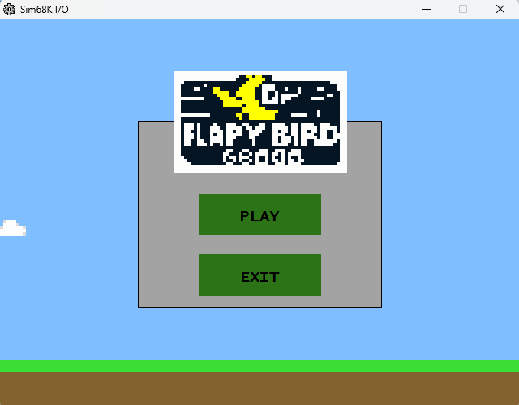
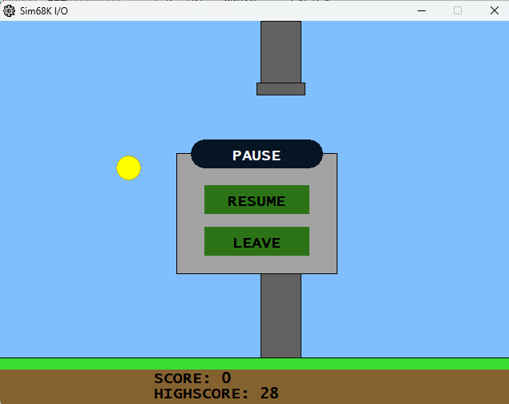
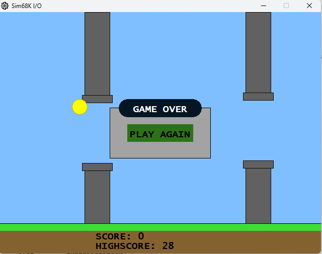
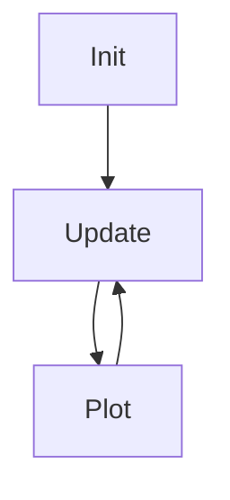

# 🐦 Flappy-Bird-68K

*Flappy-Bird-68K* es una versión del popular juego **Flappy Bird** desarrollado en lenguaje ensamblador para los procesadores Motorola 68000. Está diseñado para ser ejecutado en el simulador **EaSy68K** y fue desarrollado como proyecto final de la asignatura **Estructura de Computadores II**, parte del grado de Ingeniería Informática en la **Universidad de las Islas Baleares (UIB)**.

## 🎮 Capturas del Proyecto

### Menú de Inicio
  

### Pausa
  

### Game Over
  

## 📂 Estructura del Proyecto

El proyecto está organizado de la siguiente manera:

- **TILES/**: Contiene los convertidores de gráficos (nubes y logotipo) para ser utilizados en el juego.
- **DATA/**: Almacena datos esenciales como la configuración de nubes, logotipos y las puntuaciones del jugador.
- **LIB/**: Incluye librerías personalizadas para el manejo de gráficos, variables, agentes y utilidades.
- **SND/**: Archivos de sonido para mejorar la experiencia del jugador.

## 🛠️ Requisitos

Para ejecutar este proyecto, necesitarás:

- El simulador [**EaSy68K**](http://www.easy68k.com/) para procesadores Motorola 68000.
- Conocimientos básicos del ensamblador 68K.

## 🚀 Estructura del Ciclo de Juego

El juego sigue la clásica estructura de un ciclo de juego:

1. **Init**: Se inicializan todos los objetos del juego (jugador, tuberías, nubes, etc.).
2. **Update**: Se actualizan los estados en función de las entradas del jugador (teclado y ratón) y las reglas del juego.
3. **Plot**: Se dibujan los elementos en pantalla, actualizando la posición del jugador, los obstáculos (tuberías) y el fondo (nubes).

## 🌟 Desafíos Destacados

**Gestión de I/O**:
Se implementa la captura de eventos desde teclado y ratón, así como la salida gráfica y de sonido, logrando una experiencia fluida.

**Uso de "Agentes":**
Implementación de un sistema de agentes que permite una aproximación a la programación orientada a objetos. Esto facilita la creación de múltiples instancias de elementos, como tuberías y nubes, con comportamiento independiente.

## 📁 Manejo de Archivos
El juego incluye funcionalidades para grabar y leer datos de un archivo externo, permitiendo:

**Guardar la máxima puntuación:**
Al finalizar una partida, se guarda la puntuación más alta alcanzada en un archivo para poder consultarla en futuras partidas.

**Lectura de archivos de imagen:**
Se implementa la carga de gráficos desde archivos externos, lo que fue uno de los grandes retos del proyecto. Esto permite mostrar imágenes como las nubes y el logotipo en el juego.

## 🔊 Sonidos
El juego incluye efectos de sonido que mejoran la experiencia de juego:

- **DIE.wav**: Sonido cuando el jugador pierde.
- **JUMP.wav**: Sonido cuando el pájaro salta.
- **SCO.wav**: Sonido cuando el jugador gana puntos.

## ⌨️ Controles
- **Espacio**: Hacer saltar al pájaro.
- **Esc**: Pausar el juego.
- **Ratón**: Interactuar con los menús.

## 🎮 Cómo Jugar
1. Carga el archivo MAIN.X68 del proyecto en el simulador EaSy68K.
2. Ejecuta el código.
3. Asegurate de seleccionar el archivo generado MAIN.S68 para la ejecución.
4. Asegurate de permitir las excepciones en la configuración al ejecutar.
5. Utiliza el teclado o el ratón para controlar al pájaro. El objetivo es pasar entre las tuberías sin chocar con ellas ni con el suelo.
6. Cada tubería que logres cruzar te otorga un punto. ¡A ver cuántos puedes conseguir antes de chocar!

## 🚩 Hitos y Logros Técnicos
- ✅ Implementación de múltiples agentes para simular varios objetos en pantalla simultáneamente (nubes, tuberías).
- ✅ Gestión eficiente del input y output (teclado, ratón, pantalla y sonido).
- ✅ Implementación de librerías gráficas que permiten dibujar imágenes.
- ✅ Uso de librerías personalizadas para manejar los distintos aspectos del juego.

## 📜 Créditos
Este proyecto fue desarrollado como parte del trabajo final de la asignatura Estructura de Computadores II del grado de Ingeniería Informática en la Universidad de las Islas Baleares (UIB).